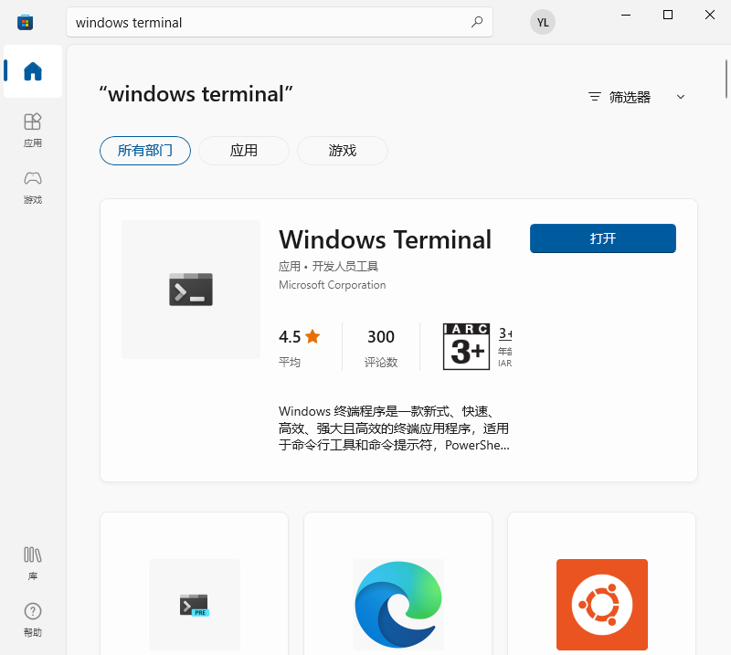
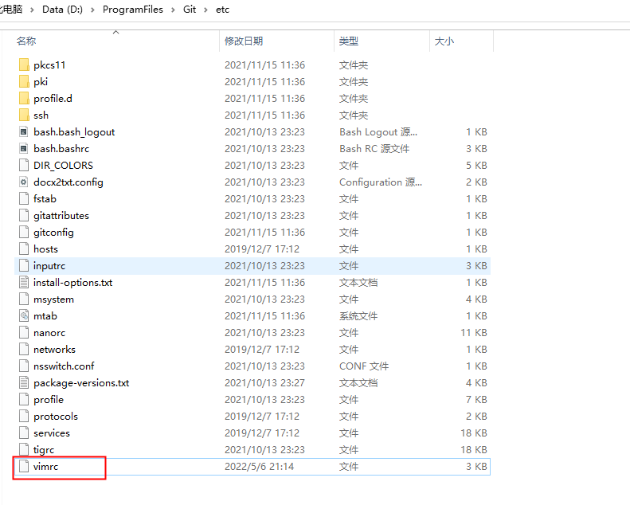

windows terminal PowerShell 如果想要和Linux系统一样用vim 来对文本进行一些操作可以使用 git 自带的vim

## 安装

1. windows terminal 可以在 windows 商店下载


2. git 安装这个网上都有教程，很简单无脑安装就可以

## 查看 PowerShell home

首先用管理员权限登录 windows terminal
```shell
echo $PSHOME

# C:\Windows\System32\WindowsPowerShell\v1.0

cd C:\\Windows\\System32\\WindowsPowerShell\\v1.0

# 新建 profile 文件
new-Item profile.ps1

# 用记事本打开文件 当然你也可以用其他的编辑器打开
notepad .\profile.ps1

```

## 配置profile
```
$SCRIPTPATH = "D:\ProgramFiles\Git\usr\share\vim"    # 此行根据$VIMPATH寻找相应vim路径即可
$VIMPATH    = "D:\ProgramFiles\Git\usr\bin\vim.exe"  # 此行为1中vim.exe路径

Set-Alias vi   $VIMPATH
Set-Alias vim  $VIMPATH

# for editing your Vim settings
Function Edit-Vimrc
{
    vim $home\_vimrc
}
```

## end
配置完后重新打开windows terminal
vim 就可以使用了

在使用过程中可能会碰到输入中文乱码的问题
在 git 安装目录下找到etc目录进去找到vimrc 文件 打开 把下面的设置填写上去


```shell
set fileencodings=utf-8,ucs-bom,gb18030,gbk,gb2312,cp936
set termencoding=utf-8
set encoding=utf-8
```

